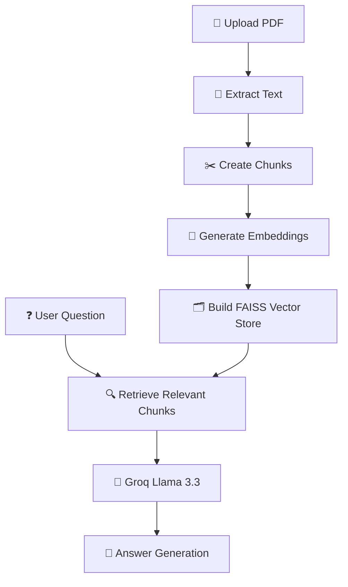
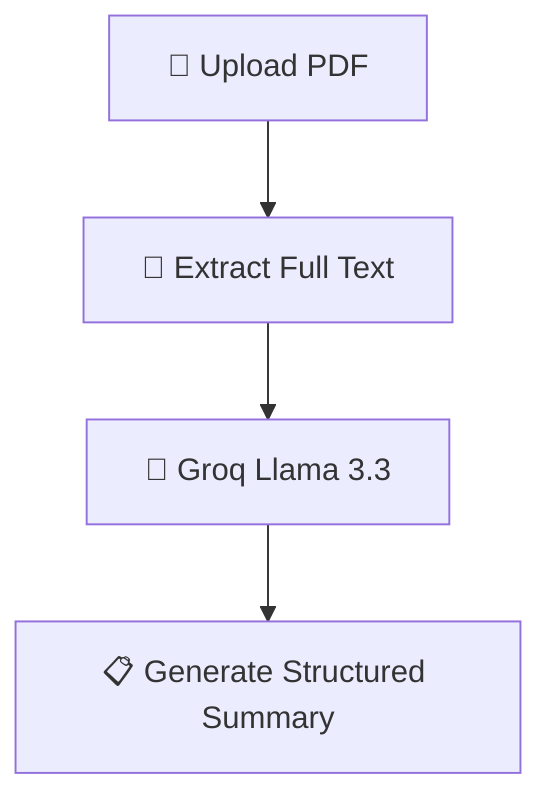
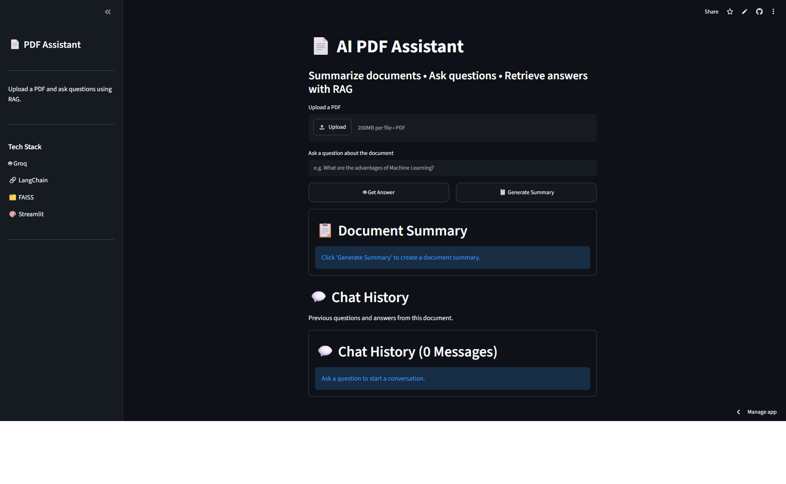
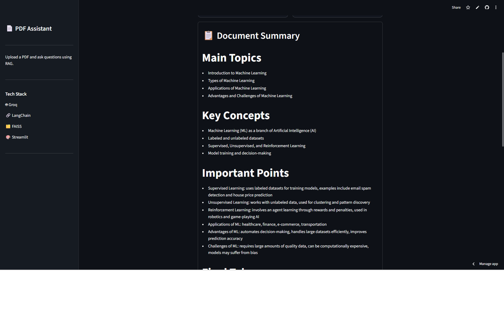
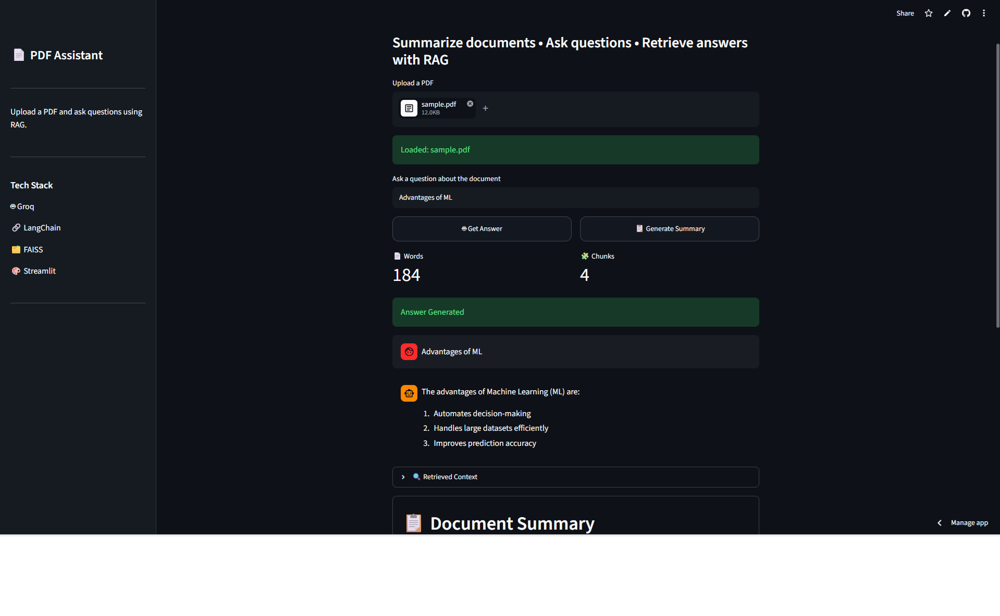

# 📄 AI Study Assistant

An AI-powered PDF Study Assistant that allows users to upload PDF documents, generate intelligent summaries, and ask questions using Retrieval-Augmented Generation (RAG).

Built with Streamlit, LangChain, FAISS, Hugging Face Embeddings, and Groq Llama 3.3.

---

## 🚀 Features

* 📄 Upload PDF documents
* 🤖 Ask questions about document content
* 🔍 Semantic search using vector embeddings
* 🧠 Retrieval-Augmented Generation (RAG)
* 📋 AI-generated document summaries
* 💬 Chat-style conversation interface
* 📚 Chat history tracking
* ⚡ Vector store caching for faster responses
* 🌙 Dark-themed responsive UI

---

## 🏗️ RAG Workflow



## 📋 Summary Workflow



---

## 🛠️ Tech Stack

### Frontend

* Streamlit

### AI / LLM

* Groq API
* Llama 3.3 70B Versatile

### RAG Pipeline

* LangChain
* FAISS
* Hugging Face Embeddings

### Document Processing

* PyPDF

---

## 📂 Project Structure

```text
AI_Study_Assistant/
│
├── app.py
├── pdf_reader.py
├── chunker.py
├── vector_store.py
├── llm.py
├── summary.py
├── requirements.txt
│
└── .streamlit/
    └── config.toml
```

---

## ⚙️ Installation

### Clone Repository

```bash
git clone https://github.com/Ruby-Rubin/AI_Study_Assistant
cd AI_Study_Assistant
```

### Create Virtual Environment

```bash
python -m venv venv
```

### Activate Environment

Windows:

```bash
venv\Scripts\activate
```

Linux / macOS:

```bash
source venv/bin/activate
```

### Install Dependencies

```bash
pip install -r requirements.txt
```

---

## 🔑 Environment Variables

Create a `.env` file:

```env
GROQ_API_KEY=your_groq_api_key
```

---

## ▶️ Run Locally

```bash
streamlit run app.py
```

---

## 🌐 Live Demo


```text
https://aistudyassistant-9edif9pwxwmshefvkyoqte.streamlit.app
```

---

## 📸 Screenshots

### Home Screen



### Document Summary



### Question Answering



### Chat History


## 🎯 Future Improvements

* Generate MCQs from uploaded PDFs
* Flashcard generation
* Multi-PDF support
* Download summary as PDF
* Conversation memory
* Citation highlighting
* Voice-based question answering

---

## 👨‍💻 Author

Rubin Kanna

Artificial Intelligence & Data Science Student

